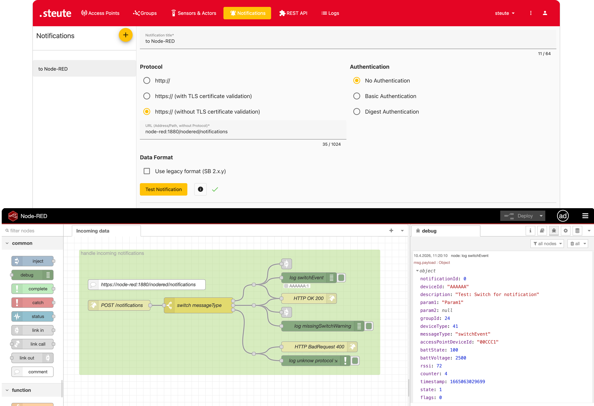

# steute Sensor Bridge & Node-RED - Demo

A simple Node-RED flow that receives notifications from the steute Sensor Bridge.



## Import the Node-RED project

See https://nodered.org/docs/user-guide/projects/ for more information about Node-RED projects.

- Enable Projects in Node-RED (if not already done).
- Create a project.
- Select **Clone Repository**.
- Set the Git repository URL to `https://github.com/steute/sb-node-red-demo.git`.
- Leave **Username**, **Password**, and **Credential encryption key** empty.
- Clone the repository.

You will see an **Incoming Data** flow with an HTTP node that accepts incoming POST requests, performs minimal processing, and includes debug nodes.

## Configure a notification

In the steute Sensor Bridge web interface:

- Create a new notification.
- Select the `http://` protocol.
- Set the URL to `node-red:1880/nodered/notifications` (\*1).
- Click **Test Notification**.
- Click **Save** at the bottom of the page.

After you click **Test Notification**, you should see incoming data in the Node-RED debug window. The incoming `msg` object from the **log switchEvent** node should look like this:

```json
{
  "notificationId": 0,
  "deviceId": "AAAAAA",
  "description": "Test: Switch for notification",
  "param1": "Param1",
  "param2": null,
  "groupId": 24,
  "deviceType": 41,
  "messageType": "switchEvent",
  "accessPointDeviceId": "00CCC1",
  "battState": 100,
  "battVoltage": 2500,
  "rssi": 72,
  "counter": 4,
  "timestamp": 1665063029699,
  "state": 1,
  "flags": 0,
  "_msgid": "2d916e6010cab466"
}
```

_(\*1) This URL matches the default Sensor Bridge setup shown in the online documentation. Your URL may differ in other setups._
